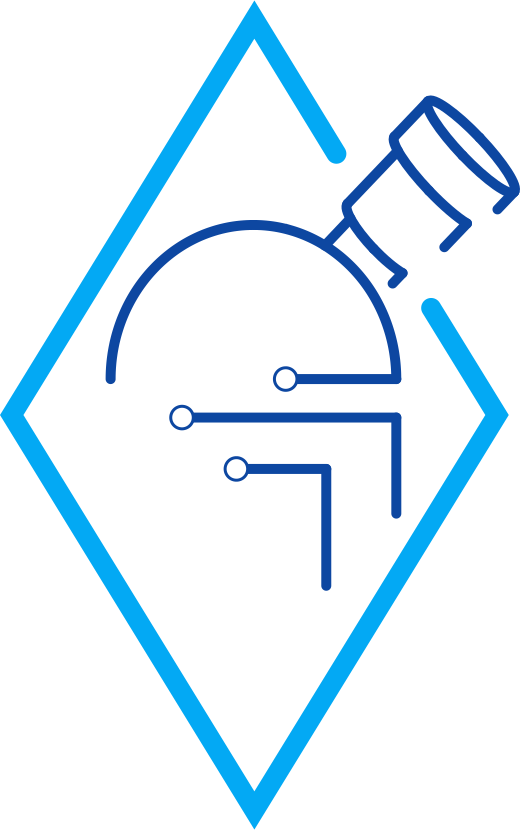

# Ground Station Software *ObserWARRtory*

### Current stable build of Ground Station Software

### -> [Development Build](#local-execution-for-development)
### -> [Docker Deployment](#docker-deployment-and-execution)

________
## Local Execution for Development
### Required Installs
---------------------
- [NodeJS](https://nodejs.org/en/) (includes npm) 
- Angular CLI

        npm install -g @angular/cli

### Install dependencies
---------------------
- Navigate to the Angular directory

        obserwarrtory-mk-i/obserwarrtory

- Install all the libraries

        npm i

- Navigate to the NodeJS directory

        obserwarrtory-mk-i/backend

- Install all the libraries

        npm i

### Run in Development mode
---------------------

- Run the Webapp (in obserwarrtory-mk-i/obserwarrtory)
        
        ng serve -o

- Run the Backend (in obserwarrtory-mk-i/Backend)

        npm run dev

### Issues
---------------------
FILESIZE: The installed dependencies (node_modules folder) currently amount to ~500MB!

To get rid of compile warnings:

- Navigate to file golden-layout.component.d.ts

        obserwarrtory-mk-i/obserwarrtory/node_modules/ngx-golden-layout/lib/golden-layout.component.d.ts

- Change line

        private goldenLayout;

- To

        public goldenLayout;

(node_modules directory is not tracked by git)

________
## Docker Deployment and Execution
### Required Installs
---------------------
- [WSL](https://docs.microsoft.com/en-us/windows/wsl/install-win10) if you are on Windows
- [Docker](https://docs.docker.com/engine/install/) 

### Build Containers
---------------------
- Navigate to the Angular directory

        obserwarrtory-mk-i/obserwarrtory

- Build Frontend Container

        docker build -t obserwarrtory_frontend .

- Navigate to root directory

        obserwarrtory-mk-i/

- Build Backend Container (Backend is dependent on Interfaces from Frontend)

        docker build -t obserwarrtory_backend .

### Run the Containers
---------------------
- Make sure Docker Daemon is running

- Frontend

        docker run -p 3000:3000 obserwarrtory_frontend

- Backend

        docker run -p 3000:3000 5006:5006 obserwarrtory_backend
